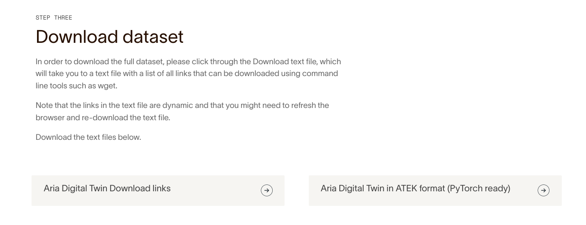

# ATEK Data Store

ATEK Data Store is a data platform where preprocessed open Aria datasets in WebDataset (WDS) formats, with selected preprocessing configurations, are available for users to directly download and load into PyTorch.

## ATEK datasets in WDS format

Aria Open Dataset        | Preprocess configuration | Download link
------------------------ | ------------------------ | --------------------------------------------------------
AriaDigitalTwin          | cubercnn                 | [access link](https://www.projectaria.com/datasets/adt/)
AriaDigitalTwin          | efm                      | [access link](https://www.projectaria.com/datasets/adt/)
AriaSyntheticEnvironment | cubercnn                 | [access link](https://www.projectaria.com/datasets/ase/)
AriaSyntheticEnvironment | cubercnn_eval            | [access link](https://www.projectaria.com/datasets/ase/)
AriaSyntheticEnvironment | efm                      | [access link](https://www.projectaria.com/datasets/ase/)
AriaSyntheticEnvironment | efm_eval                 | [access link](https://www.projectaria.com/datasets/ase/)

Details of each preprocessing configuration are listed [here](../data/atek_data_store_confs/).

## How to access ATEK data

We provide 2 options to access data from ATEK Data Store:

1. By default, the preprocessed dataset is **downloaded** to user's local computer. This is recommended for model training.
2. Or, the dataset can also be **streamed** via their URLs. However this will be impacted by internet connections, hence only recommended for small-scale testing.

To access the data:

1. Click the **access link** in the above table, you can find the **Access The Dataset** button on the bottom of the page. Input your email address, you will be redirected to a page where you will find a button to download **[dataset] in ATEK format (PyTorch ready)**.

  

2. This will download a json file, e.g. `[dataset_name]_ATEK_download_urls.json`, that contains the URLs of the actual preprocessed data. Note that for the same dataset, all preprocessing configuration's URLs are contained in the same json file.

3. First, make sure you have [installed ATEK lib](./Install.md#core-lib-installation). You can then download the data using ATEK-provided downloader script:

  ```bash
  python3 ${ATEK_SRC}/tools/atek_wds_data_downloader.py \
  --config-name ${config_name} \
  --input-json-path ${downloaded_url_json} \
  --output-folder-path ${output_folder} \
  --download-wds-to-local
  ```

  where :

  - `--config-name` specifies which [preprocessing configuration](./preprocessing_configurations.md) you would like to download.
  - `--download-wds-to-local` user can remove this flag to create **streamable** yaml files.

    User can also specify other options including maximum number of sequences to download, training validation split ratio, etc. See [src code](../tools/atek_wds_data_downloader.py) for details.

4. **Note that these URLs will EXPIRE AFTER 30 DAYS**, user will need to re-download and re-generate the streamable yaml files.

These steps will download ATEK preprocessed WebDataset files with the following folder structure. Note that if the download breaks in the middle, simply run it again to pick up from the middle.

```bash
./downloaded_local_wds
  ├── 0
  │   ├── shards-0000.tar
  │   ├── shards-0001.tar
  │   └── shards-0002.tar
  ├── 1
  │   ├── shards-0000.tar
  │   └── shards-0001.tar
  ├── ...
  ├── local_all_tars.yaml
  ├── local_train_tars.yaml
  └── local_validation_tars.yaml
```

If `--download-wds-to-local` flag is removed, the script will only create 3 streamable yaml files without downloading any data:

```bash
./output
  ├── streamable_all_tars.yaml
  ├── streamable_train_tars.yaml
  └── streamable_validation_tars.yaml
```

## Load ATEK Data Store yaml file

The generated `streamable_*.yaml` and `local_*.yaml` files contain local or remote URLs of the preprocessed WDS files. The following API can load them into a `List` of URLs that can be input into [ATEK data loader APIs](./data_loading_and_inference.md)

```python
tar_file_urls = load_yaml_and_extract_tar_list(yaml_path="./local_all_tars.yaml")
```
