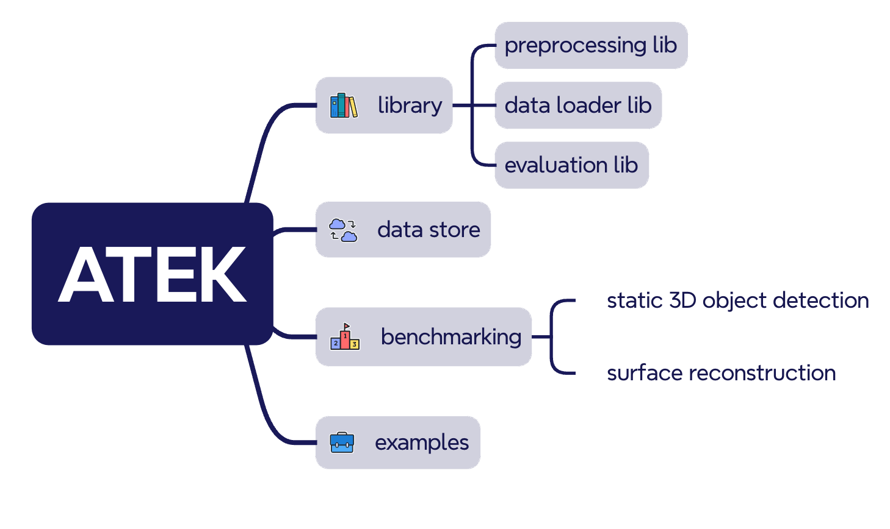
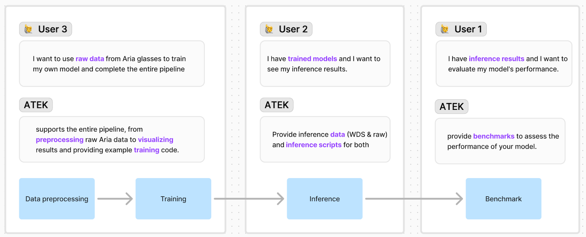

# Aria Training and Evaluation toolkit (ATEK)

ATEK is a toolbox from the `projectaria` team specially built for the Machine Learning (ML) community. It seeks to lower the frictions for users using Aria data in ML research, and accelerate their development cycle, by addressing the following pain points:

- `VRS` format in open Aria datasets are **not PyTorch compatible**.
- Users need to write a lot of **hand-crafted boiler plate code** to preprocess Aria data, which requires expertise on Aria specs.
- It is time and resource consuming to preprocess large Aria datasets.
- There is no fair competing ground to compare model performacnes for Aria-specific tasks.

To address these issues, ATEK provides the followings to the community: 

- An easy-to-use data preprocessing library for Aria datasets.
- Data Store with downloadable preprocessed Aria datasets.
- Standardized evaluation libraries that supports the following ML perception tasks for Aria:

  - static 3D object detection
  - 3D surface reconstruction

- Rich notebook and script examples including model training, inference, and visualization.

And users can engage ATEK in their projects with 3 different starting points: 

- Just want to run some evaluation, even on non-Aria data? Check out [ATEK evaluation libraries](./docs/evaluation.md)!

- Want to try your trained-model on ego-centric Aria data? Just download processed data from our [Data Store](./docs/ATEK_Data_Store.md), and check out how to run [model inference](./docs/data_loading_and_inference.md)!

- Now ready for the full ML adventure from raw Aria data? Check out our full [table of contents](#table-of-content)!

## Interactive Python notebook playground (Google Colab)

User can start with our Google Colab notebook, which shows an example of running and evaluating a 3D object detection model called `CubeRCNN`, on an Aria Digital Twin data sequence, which involes data-preprocessing, model inference, and evaluation.

## Table of content

- [Installation](docs/Install.md)
- [ATEK Data Store](./docs/ATEK_Data_Store.md)
- Technical specifications

  - [Data Preprocessing](./docs/preprocessing.md)
  - [Data Loader for inference and training](./docs/data_loading_and_inference.md)
  - [Evaluation](./docs/evaluation.md)

- [Machine Learning tasks supported by ATEK](docs/evaluation.md)
  - [static 3D object detection](./ML_task_object_detection.md)
  - [3D surface reconstruction](./ML_task_surface_recon.md)
- Examples

  - [Example: demo notebooks](./docs/example_demos.md)
  - [Example: customization for SegmentAnything2 model](./docs/example_sam2_customization.md)
  - [Example: customization for CubeRCNN model](./docs/example_cubercnn_customization.md)
  - [Example: CubeRCNN model training](./docs/example_training.md)

## License

